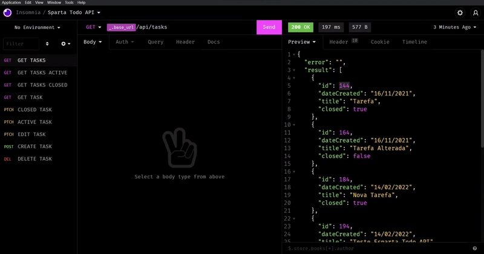

# esparta-todo-api

> A Rest Full API for to-do list (a sparta-io challenge)

Preview



## 🔗 EndPoints

Test URL: ``` https://esparta-todo-api.herokuapp.com ```


Get Tasks: ```{base_url}/api/tasks```

Get Active Tasks: ```{base_url}/api/tasks/active```

Get Closed Tasks: ```{base_url}/api/tasks/closed```

Get Task: ```{base_url}/api/task/{id}```

Closed Task: ```{base_url}/api/closed/task/{id}```

Active Task: ```{base_url}/api/active/task/{id}```

Edit Task: ```{base_url}/api/edit/task/{id}```

Create Task: ```{base_url}/api/create/task```

Delete Task: ```{base_url}/api/delete/task/{id}```

## 🛠 Technologies and Tools used
1. Cors
2. Express JS
3. Heroku Hosting
4. Node JS 
5. MySQL


## ⚙️ Install Locally

1. Clone the repository: ```git clone https://github.com/jhollyferr/esparta-todo-api.git```
2. Unzip and open with visual studio code
3. Run ```yarn install``` to configure dependencies
4. Run the server with ```yarn start```
5. Test, change, run endpoints and give a 👍


<br>

> with ❤️ Jhollyfer Rodrigues 